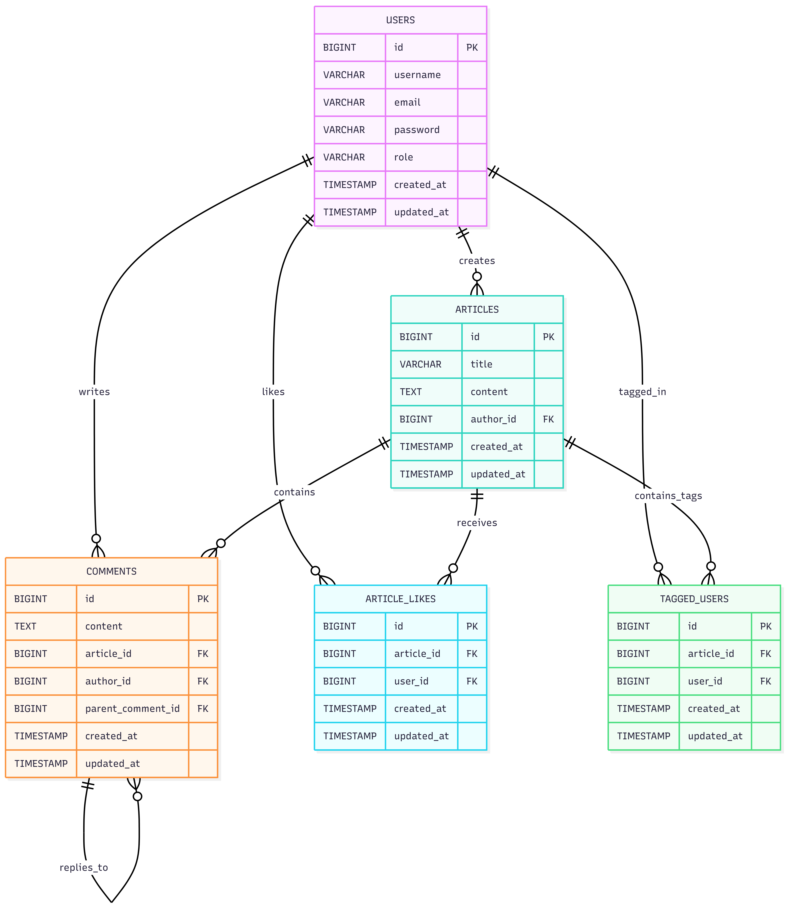
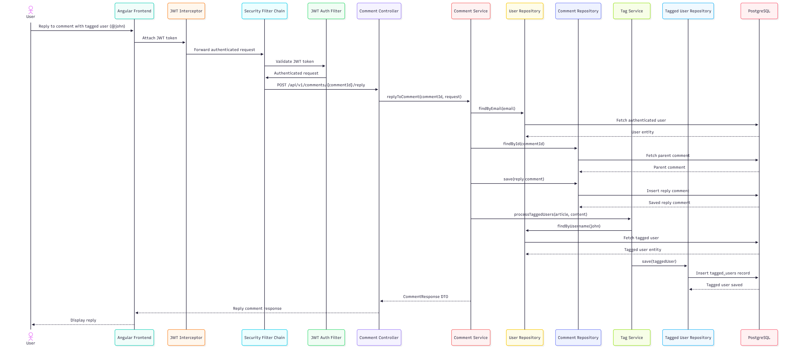
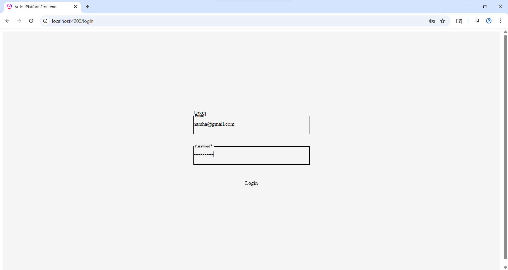
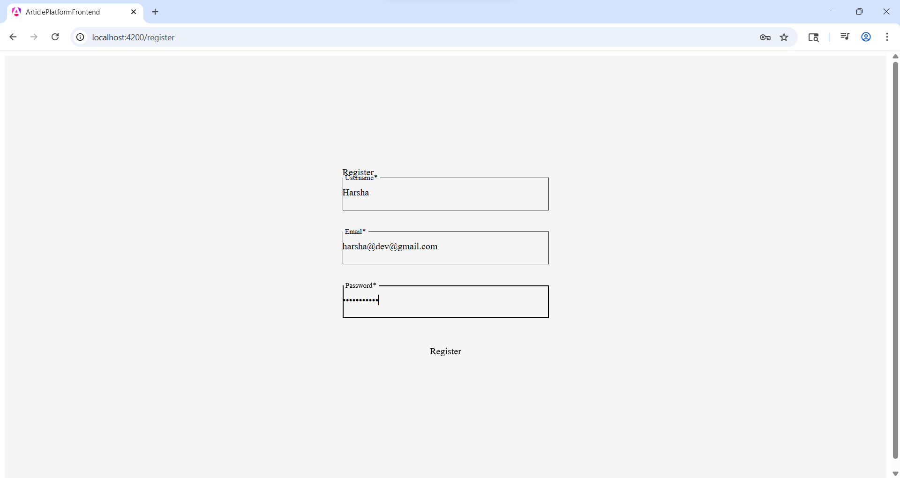
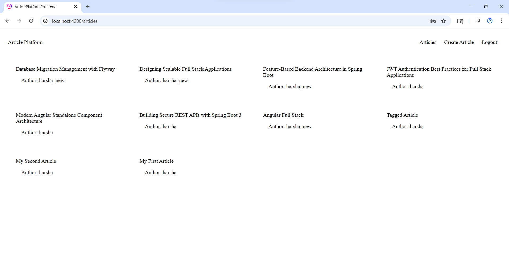
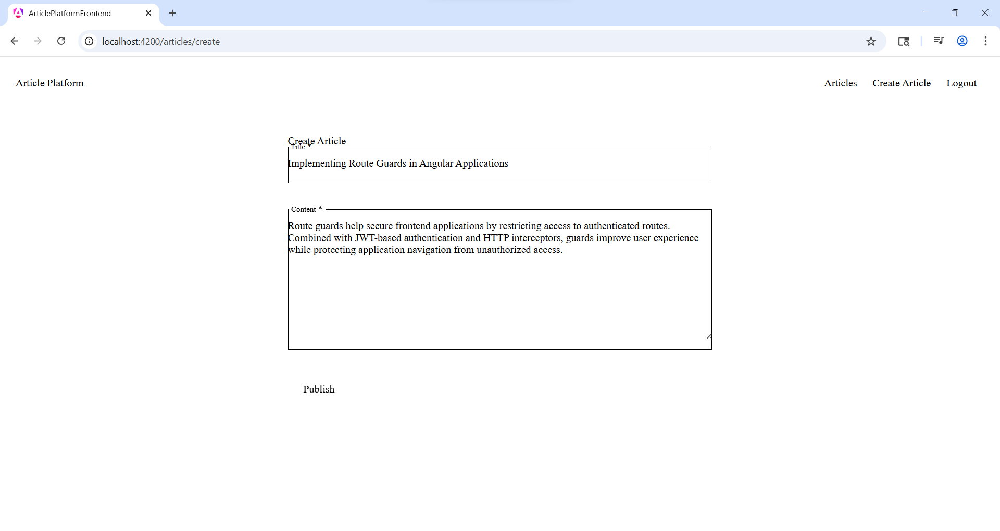
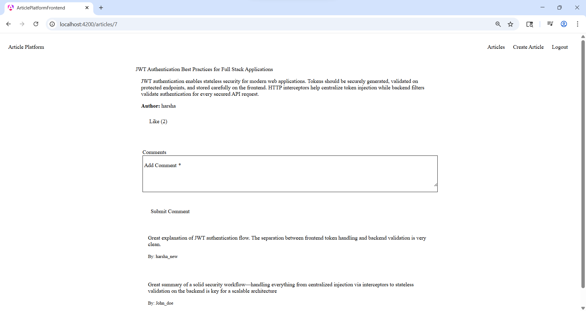

# Article Publishing Platform

A secure full-stack Article Publishing Platform built using Spring Boot 3, Angular 21, PostgreSQL, and JWT Authentication.

The application allows authenticated users to publish articles, browse article feeds, comment on articles, and interact through likes using a responsive Angular frontend integrated with secure REST APIs.

---

# Project Goals

This project was designed to demonstrate:

- Full-stack application development
- Secure JWT-based authentication
- Feature-based modular architecture
- Clean API design
- Modern Angular standalone architecture
- Frontend/backend integration
- Scalable project organization
- Enterprise development practices

---

# Technology Stack

## Backend

| Technology | Purpose |
|---|---|
| Java 17 | Backend Programming Language |
| Spring Boot 3.5 | Backend Framework |
| Spring Security | Authentication & Authorization |
| JWT | Stateless Authentication |
| Spring Data JPA | ORM/Data Access |
| Hibernate | Persistence Provider |
| PostgreSQL | Relational Database |
| Flyway | Database Migration |
| Maven | Dependency Management |

---

## Frontend

| Technology | Purpose |
|---|---|
| Angular 21 | Frontend Framework |
| TypeScript | Typed Frontend Development |
| Angular Material | UI Components |
| RxJS | Reactive Programming |
| Reactive Forms | Form Handling |
| Angular Route Guards | Route Protection |
| HTTP Interceptors | JWT Injection |

---

# Features

## Authentication
- User Registration
- User Login
- JWT Token Generation
- Protected Routes
- Secure API Access

---

## Articles
- View Article Feed
- Create Articles
- View Article Details

---

## Comments
- Add Comments to Articles
- View Article Comments
- Reply to Comments
- Tagged User Processing Support

---

## Likes
- Like Articles

---

# Backend Architecture

The backend follows a **feature-based modular architecture**.

Each business domain encapsulates its own:
- controller,
- service,
- repository,
- DTO,
- entity,
- feature-specific logic.

This structure improves:
- maintainability,
- modularity,
- scalability,
- separation of concerns.

Within each feature module, layered separation of responsibilities is maintained.

---

# Backend Project Structure

```text
article-platform-backend
│
├── src/main/java/com/articlehub
│   │
│   ├── auth
│   │   ├── controller
│   │   ├── dto
│   │   ├── entity
│   │   ├── repository
│   │   └── service
│   │
│   ├── article
│   │   ├── controller
│   │   ├── dto
│   │   ├── entity
│   │   ├── mapper
│   │   ├── repository
│   │   └── service
│   │
│   ├── comment
│   │   ├── controller
│   │   ├── dto
│   │   ├── entity
│   │   ├── mapper
│   │   ├── repository
│   │   └── service
│   │
│   ├── like
│   │   ├── controller
│   │   ├── entity
│   │   ├── repository
│   │   └── service
│   │
│   ├── tag
│   │   ├── entity
│   │   ├── repository
│   │   └── service
│   │
│   ├── user
│   │   ├── entity
│   │   ├── repository
│   │
│   ├── security
│   │   ├── config
│   │   ├── jwt
│   │   └── service
│   │
│   ├── config
│   │
│   ├── common
│   │
│   ├── exception
│   │   ├── custom
│   │   └── handler
│   │
│   └── ArticlePlatformBackendApplication
│
├── src/main/resources
│   ├── db/migration
│   └── application.yaml
│
└── pom.xml
```

---

# Backend Design Decisions

## Feature-Based Modular Organization

Business domains such as:
- auth,
- article,
- comment,
- like

are isolated into separate modules.

This keeps features cohesive and improves long-term scalability.

---

## DTO Pattern

DTOs were implemented to:
- separate API contracts from persistence entities,
- avoid exposing internal entity structures,
- improve API maintainability.

---

## JWT Authentication

JWT-based authentication was implemented to provide:
- stateless authentication,
- scalable API security,
- frontend/backend decoupling.

---

## Global Exception Handling

Centralized exception handling was implemented using:
- `@RestControllerAdvice`
- custom exceptions
- standardized error responses

---

## Flyway Migration

Flyway was used for:
- database version control,
- schema consistency,
- reproducible database setup.

---

# Frontend Architecture

The frontend follows a **feature-based Angular architecture** using standalone components.

Features are organized by business capability rather than technical type.

Example:
- auth
- articles
- comments
- likes

This structure improves:
- modularity,
- scalability,
- maintainability.

---

# Frontend Project Structure

```text
article-platform-frontend
│
├── src/app
│   │
│   ├── core
│   │   ├── guards
│   │   ├── interceptors
│   │   └── services
│   │
│   ├── features
│   │   ├── auth
│   │   │   ├── login
│   │   │   └── register
│   │   │
│   │   ├── articles
│   │   │   ├── article-list
│   │   │   ├── article-detail
│   │   │   └── create-article
│   │
│   ├── layout
│   │   └── navbar
│   │
│   ├── models
│   │
│   ├── app.config.ts
│   ├── app.routes.ts
│   └── app.ts
│
├── src/environments
│
└── package.json
```

---

# Frontend Design Decisions

## Standalone Components

Angular standalone components were used instead of NgModules to:
- reduce boilerplate,
- simplify architecture,
- improve modularity.

---

## HTTP Interceptor

A JWT interceptor automatically attaches authorization headers to outgoing API requests.

This centralizes authentication handling and avoids repetitive authorization logic.

---

## Route Guards

Angular route guards were implemented to:
- protect authenticated routes,
- redirect unauthenticated users to login page.

---

# Authentication Flow

```text
User Login
    ↓
Spring Security Authentication
    ↓
JWT Token Generation
    ↓
Angular Stores Token in localStorage
    ↓
JWT Interceptor Adds Authorization Header
    ↓
Protected APIs Validate JWT
```

---

# Database Configuration

Configuration file:

```text
src/main/resources/application.yaml
```

Example:

```yaml
spring:
  datasource:
    url: jdbc:postgresql://localhost:5432/article_platform
    username: postgres
    password: postgres
```

---

# Database ERD



---

# Reply Comment With User Tagging — Sequence Diagram



---

# Backend Setup

## Prerequisites

- Java 17
- Maven
- PostgreSQL

---

## Create Database

```sql
CREATE DATABASE article_platform;
```

---

## Run Backend

Navigate to backend project:

```bash
cd article-platform-backend
```

Run application:

```bash
mvn spring-boot:run
```

Backend runs on:

```text
http://localhost:8080
```

---

# Frontend Setup

## Prerequisites

- Node.js
- Angular CLI

---

## Install Dependencies

Navigate to frontend project:

```bash
cd article-platform-frontend
```

Install dependencies:

```bash
npm install
```

---

## Run Frontend

```bash
ng serve
```

Frontend runs on:

```text
http://localhost:4200
```

---

# API Endpoints

## Authentication

| Method | Endpoint |
|---|---|
| POST | `/api/v1/auth/register` |
| POST | `/api/v1/auth/login` |

---

## Articles

| Method | Endpoint |
|---|---|
| GET | `/api/v1/articles` |
| GET | `/api/v1/articles/{id}` |
| POST | `/api/v1/articles` |

---

## Comments

| Method | Endpoint |
|---|---|
| GET | `/api/v1/comments/article/{articleId}` |
| POST | `/api/v1/comments/article/{articleId}` |

---

## Likes

| Method | Endpoint |
|---|---|
| POST | `/api/v1/likes/article/{articleId}` |

---
# Application Screenshots

---

## Login Page



---

## Register Page



---

## Article Feed



---

## Create Article



---

## Article Detail & Comments



---

# Security Features

- JWT Authentication
- JWT Request Filter Validation
- Password Encryption
- Protected Routes
- HTTP Interceptors
- Angular Route Guards
- Spring Security Configuration

---

# Architectural Notes

The reply comment with user tagging flow represented in the sequence diagram demonstrates the extensibility of the platform architecture for future mention and notification capabilities.

While the current implementation focuses on article publishing, comments, likes, and authentication, the system design supports future enhancements such as:

- tagged user notifications
- advanced mention and notification workflows
- activity feeds
- real-time notifications

The current database schema also includes a `tagged_users` relationship table associated with articles, which provides foundational support for extending tagging and mention-related functionality in future iterations of the platform.

---

# Future Improvements

- Rich Text Editor
- Nested Comments
- Search & Filtering
- Docker Compose Integration
- AWS Deployment
- Terraform Infrastructure
- CI/CD Pipelines

---

# Author

Harsha Mudaliar